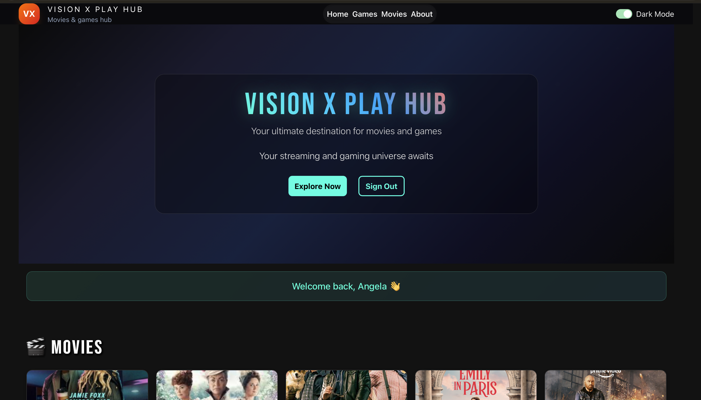
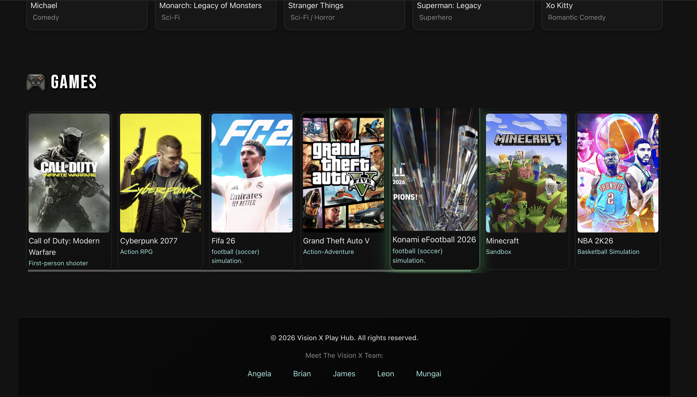
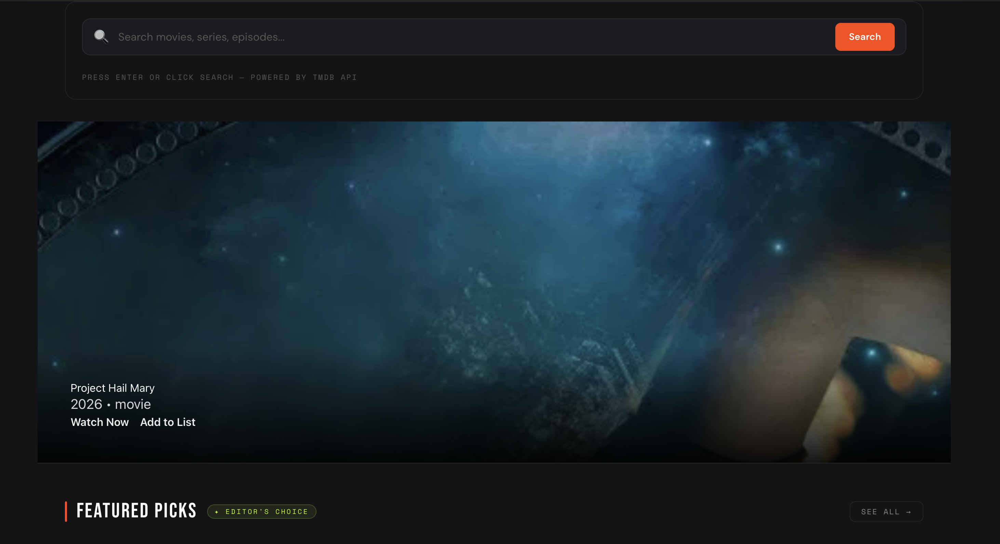
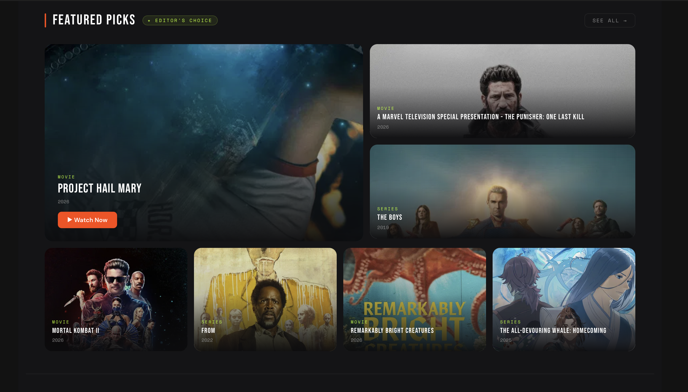
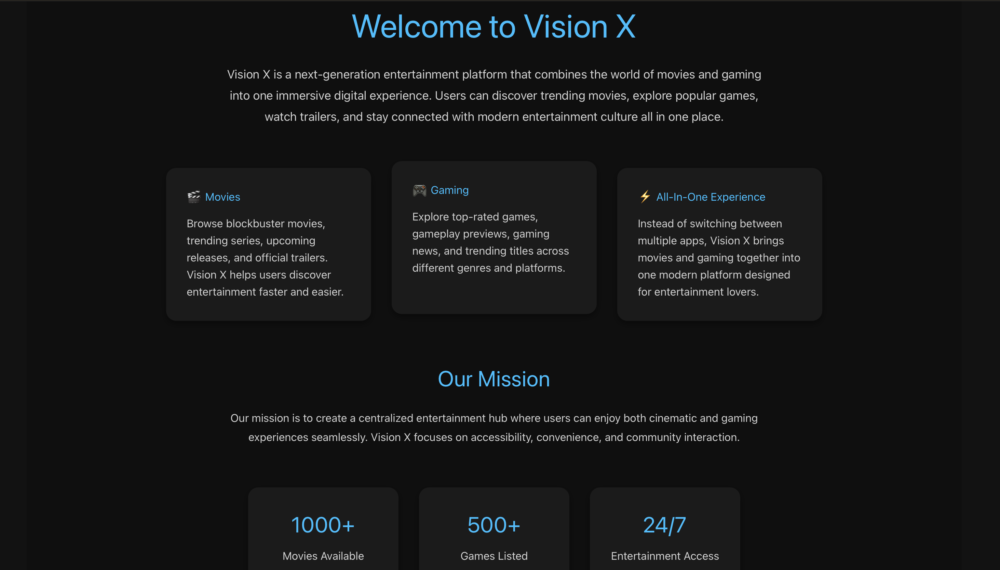

# Vision X Play Hub


<div align="center">

**A unified entertainment platform for Movies & Video Games — Browse, Search, Discover.**

[](https://reactjs.org/)
[](https://vitejs.dev/)
[](https://jwt.io/)
[](https://www.themoviedb.org/)
[](https://rawg.io/)
[](https://developer.mozilla.org/en-US/docs/Web/CSS)


</div>

---

##  Table of Contents

- [About the Project](#-about-the-project)
- [Screenshots](#-screenshots)
- [Features](#-features)
- [Tech Stack](#-tech-stack)
- [APIs Used](#-apis-used)
- [Project Structure](#-project-structure)
- [Getting Started](#-getting-started)
  - [Prerequisites](#prerequisites)
  - [Installation](#installation)
  - [Environment Variables](#environment-variables)
  - [Running the App](#running-the-app)
- [Authentication](#-authentication)
- [Pages & Routing](#-pages--routing)
- [Component Overview](#-component-overview)
- [API Integration Details](#-api-integration-details)
- [Contributing](#-contributing)
- [License](#-license)
- [Acknowledgements](#-acknowledgements)

---

##  About the Project

**Vision X Play Hub** is a unified entertainment discovery platform that brings together the worlds of **movies** and **video games** under one seamless interface. No more switching between apps — browse trending films from TMDB and top-rated games from RAWG.IO, watch trailers, read ratings, and get personalized recommendations, all in one place.

The platform is built with a modern frontend stack: **Vite + React** for blazing-fast development, **CSS** for custom styling, and **JWT-based authentication** to deliver a personalized, secure experience.

### Why Vision X Play Hub?

-  **Movies +  Games** in one platform — no more switching apps
-  **Unified search** across both entertainment categories
-  **Ratings & Reviews** to help you choose what to watch or play
-  **Trailers** embedded directly in the UI
-  **Smart Recommendations** based on genres and trending content
-  **JWT Authentication** for a personalized, secure session

---

#  Screenshots


###  Home [Landing Page]

*The main landing page featuring hero banners, trending movies, and top-rated games at a glance.*

---

###  Login & Registration

*JWT-secured authentication screens with clean form design and validation feedback.*

---

###  Games Section — Browse & Discover

*Browse trending, popular, top-rated, and upcoming movies powered by the TMDB API.*

---

###  Movie Section — Browse & Discover

*Individual movie page showing full synopsis, cast, genres, rating, and embedded trailer.*

---

###  Movie Detail Page Part Two

*Explore top-rated, trending, and new releases from the RAWG.IO games database.*

---

###  About & Contacts Page

*Individual game page featuring cover art, description, platforms, ESRB rating, and screenshots.*

---

#  Features

###  Movie Features (Powered by TMDB)
- Browse **Trending**, **Popular**, **Top Rated**, and **Upcoming** movies
- View detailed movie pages: synopsis, cast & crew, genres, runtime, release date
- Watch **official trailers** embedded via YouTube
- See **audience and critic ratings**
- Genre-based filtering and sorting
- Movie search with instant results
- Ability to favorite a movie

###  Game Features (Powered by RAWG.IO)
- Browse **Top Rated**, **New Releases**, and **Trending** games
- View detailed game pages: description, platforms, ESRB rating, Metacritic score
- Browse **screenshots and artwork** from within the app
- Filter by **platform** (PC, PlayStation, Xbox, Nintendo, Mobile)
- Genre-based filtering (Action, RPG, Strategy, etc.)
- Game search with instant results

###  Authentication & User Features
- Secure **JWT-based login and registration**
- Protected routes accessible only to authenticated users
- Personal **watchlist** for movies
- Personal **game library / favorites** list
- Persistent session with token refresh
- Clean logout and session management
- Favorites Section

###  General Platform Features
- **Unified search** across both movies and games
- **Responsive design** for desktop, tablet, and mobile
- Smooth **page transitions and animations**
- **Skeleton loading states** for API content
- Error boundaries and graceful error handling
- Fast performance via **Vite** build system

---

##  Tech Stack

| Layer | Technology | Purpose |
|-------|-----------|---------|
| **Frontend Framework** | React 18+ | UI component library |
| **Build Tool** | Vite 5+ | Fast dev server & bundler |
| **Styling** | CSS3 (custom) | Component-level styling |
| **Routing** | React Router v6 | Client-side navigation |
| **State Management** | React Context API / useState | App-wide state |
| **Authentication** | JWT (JSON Web Tokens) | Secure user sessions |
| **HTTP Client** | Fetch API / Axios | API requests |
| **Movie Data** | TMDB API | Movie metadata, trailers, cast |
| **Game Data** | RAWG.IO API | Game metadata, screenshots, ratings |
| **Version Control** | Git + GitHub | Source control |

---

##  APIs Used

###  TMDB — The Movie Database API
> [https://www.themoviedb.org/documentation/api](https://www.themoviedb.org/documentation/api)

| Endpoint | Usage |
|----------|-------|
| `GET /movie/trending/{time_window}` | Fetch trending movies (day/week) |
| `GET /movie/popular` | Browse popular movies |
| `GET /movie/top_rated` | Top-rated movie listings |
| `GET /movie/upcoming` | Upcoming releases |
| `GET /movie/{movie_id}` | Movie detail page data |
| `GET /movie/{movie_id}/videos` | Fetch trailers (YouTube key) |
| `GET /movie/{movie_id}/credits` | Cast and crew information |
| `GET /search/movie` | Movie search by query |
| `GET /genre/movie/list` | Genre categories |
| `GET /discover/movie` | Filter movies by genre/year/rating |

**Base URL:** `https://api.themoviedb.org/3`  
**Image Base URL:** `https://image.tmdb.org/t/p/w500{poster_path}`

---

###  RAWG.IO API
> [https://rawg.io/apidocs](https://rawg.io/apidocs)

| Endpoint | Usage |
|----------|-------|
| `GET /games` | Browse games with filters |
| `GET /games/{id}` | Game detail page data |
| `GET /games/{id}/screenshots` | Game screenshots gallery |
| `GET /games/lists/main` | Top-rated / popular games |
| `GET /genres` | Game genre list |
| `GET /platforms` | Platform filter options |
| `GET /games?search={query}` | Search games by name |

**Base URL:** `https://api.rawg.io/api`

---

##  Project Structure

```
vision-x-play-hub/
│
├── public/                        
│   └── favicon.ico
│
├── src/
│   ├── assets/                    
│   │   └── logo.png
│   │
│   ├── components/                 
│   │   ├── Navbar/
│   │   │   ├── Navbar.jsx
│   │   │   └── Navbar.css
│   │   ├── Footer/
│   │   │   ├── Footer.jsx
│   │   │   └── Footer.css
│   │   ├── MovieCard/
│   │   │   ├── MovieCard.jsx
│   │   │   └── MovieCard.css
│   │   ├── GameCard/
│   │   │   ├── GameCard.jsx
│   │   │   └── GameCard.css
│   │   ├── SearchBar/
│   │   │   ├── SearchBar.jsx
│   │   │   └── SearchBar.css
│   │   ├── HeroBanner/
│   │   │   ├── HeroBanner.jsx
│   │   │   └── HeroBanner.css
│   │   ├── TrailerModal/
│   │   │   ├── TrailerModal.jsx
│   │   │   └── TrailerModal.css
│   │   ├── RatingBadge/
│   │   │   └── RatingBadge.jsx
│   │   ├── SkeletonLoader/
│   │   │   └── SkeletonLoader.jsx
│   │   └── ProtectedRoute/
│   │       └── ProtectedRoute.jsx
│   │
│   ├── pages/                     
│   │   ├── Home/
│   │   │   ├── Home.jsx
│   │   │   └── Home.css
│   │   ├── Movies/
│   │   │   ├── Movies.jsx
│   │   │   └── Movies.css
│   │   ├── MovieDetail/
│   │   │   ├── MovieDetail.jsx
│   │   │   └── MovieDetail.css
│   │   ├── Games/
│   │   │   ├── Games.jsx
│   │   │   └── Games.css
│   │   ├── GameDetail/
│   │   │   ├── GameDetail.jsx
│   │   │   └── GameDetail.css
│   │   ├── Search/
│   │   │   ├── Search.jsx
│   │   │   └── Search.css
│   │   ├── Profile/
│   │   │   ├── Profile.jsx
│   │   │   └── Profile.css
│   │   ├── Login/
│   │   │   ├── Login.jsx
│   │   │   └── Login.css
│   │   └── Register/
│   │       ├── Register.jsx
│   │       └── Register.css
│   │
│   ├── context/                    
│   │   ├── AuthContext.jsx        
│   │   └── WatchlistContext.jsx    
│   │
│   ├── hooks/                      
│   │   ├── useMovies.js
│   │   ├── useGames.js
│   │   └── useAuth.js
│   │
│   ├── services/                   
│   │   ├── tmdbService.js          
│   │   └── rawgService.js          
│   │
│   ├── utils/                      
│   │   ├── formatDate.js
│   │   ├── truncateText.js
│   │   └── ratingColor.js
│   │
│   ├── App.jsx                   
│   ├── main.jsx                
│   └── index.css                  
│
├── .env                            
├── .env.example                   
├── .gitignore
├── index.html
├── vite.config.js
├── package.json
└── README.md
```

---

##  Getting Started

### Prerequisites

Make sure you have the following installed on your machine:

- **Node.js** `v18.0.0` or higher
- **npm** `v9+` or **yarn** `v1.22+`
- A free **TMDB API key** — [Get one here](https://www.themoviedb.org/settings/api)
- A free **RAWG.IO API key** — [Get one here](https://rawg.io/apidocs)

---

### Installation

**1. Clone the repository:**

```bash
git clone https://github.com/your-username/vision-x-play-hub.git
cd vision-x-play-hub
```

**2. Install dependencies:**

```bash
npm install
```

---

### Environment Variables

Create a `.env` file in the root of the project by copying the example:

```bash
cp .env.example .env
```

Then fill in your API keys:

```env
=============================================
  Vision X Play Hub — Environment Variables
=============================================

TMDB API (The Movie Database)
~Get your key at: https://www.themoviedb.org/settings/api
    VITE_TMDB_API_KEY=your_tmdb_api_key_here
    VITE_TMDB_BASE_URL=https://api.themoviedb.org/3
    VITE_TMDB_IMAGE_BASE_URL=https://image.tmdb.org/t/p/w500

RAWG.IO API (Games Database)
~Get your key at: https://rawg.io/apidocs
    VITE_RAWG_API_KEY=your_rawg_api_key_here
    VITE_RAWG_BASE_URL=https://api.rawg.io/api

```

>  **Important:** Never commit your `.env` file. It is already listed in `.gitignore`.  
>  All environment variables in Vite must be prefixed with `VITE_` to be exposed to the client.

---

### Running the App

**Development server:**

```bash
npm run dev
```

The app will be available at `http://localhost:5173`

**Production build:**

```bash
npm run build
```

**Preview the production build locally:**

```bash
npm run preview
```

---

##  Authentication

Vision X Play Hub uses **JWT (JSON Web Token)** for authentication:

### Flow Overview

```
User Registers / Logs In
        ↓
Server returns JWT Token
        ↓
Token stored in localStorage / httpOnly cookie
        ↓
Token attached to protected API requests (Authorization: Bearer <token>)
        ↓
Protected routes validated via ProtectedRoute component
        ↓
On logout → token cleared, user redirected to login
```

### Token Structure

```json
{
  "header": {
    "alg": "HS256",
    "typ": "JWT"
  },
  "payload": {
    "userId": "abc123",
    "username": "john_doe",
    "email": "john@example.com",
    "iat": 1716000000,
    "exp": 1716086400
  }
}
```

### Protected Routes

The following routes require authentication:

| Route | Description |
|-------|-------------|
| `/profile` | User profile and settings |
| `/watchlist` | Saved movies |
| `/favorites` | Favorite games |

Unauthenticated users are automatically redirected to `/login`.

---

##  Pages & Routing

```
/                    → Home Page (Hero + Featured Content)
/movies              → Browse All Movies
/movies/:id          → Movie Detail Page
/games               → Browse All Games
/games/:id           → Game Detail Page
/search              → Unified Search Results
/login               → Login Page
/register            → Registration Page
/profile             → User Profile (🔒 Protected)
/watchlist           → Movie Watchlist (🔒 Protected)
/favorites           → Game Favorites (🔒 Protected)
*                    → 404 Not Found Page
```

---

##  Component Overview

| Component | Description |
|-----------|-------------|
| `<Navbar />` | Top navigation with logo, links, search icon, and auth state |
| `<HeroBanner />` | Full-width hero section with featured movie/game background |
| `<MovieCard />` | Reusable card showing poster, title, release year, and rating |
| `<GameCard />` | Reusable card showing cover art, title, platform icons, and score |
| `<SearchBar />` | Debounced search input with results dropdown |
| `<TrailerModal />` | Embedded YouTube iframe modal for movie trailers |
| `<RatingBadge />` | Color-coded rating indicator (green/yellow/red) |
| `<SkeletonLoader />` | Placeholder animation while content is loading |
| `<ProtectedRoute />` | HOC that redirects unauthenticated users to `/login` |
| `<Footer />` | App footer with navigation links and credits |

---

##  API Integration Details

### TMDB Service Example (`src/services/tmdbService.js`)

```javascript
const TMDB_BASE_URL = import.meta.env.VITE_TMDB_BASE_URL;
const TMDB_API_KEY = import.meta.env.VITE_TMDB_API_KEY;

// Fetch trending movies
export const getTrendingMovies = async (timeWindow = "week") => {
  const response = await fetch(
    `${TMDB_BASE_URL}/trending/movie/${timeWindow}?api_key=${TMDB_API_KEY}`
  );
  if (!response.ok) throw new Error("Failed to fetch trending movies");
  return response.json();
};

// Fetch movie details with videos and credits
export const getMovieDetails = async (movieId) => {
  const response = await fetch(
    `${TMDB_BASE_URL}/movie/${movieId}?api_key=${TMDB_API_KEY}&append_to_response=videos,credits`
  );
  if (!response.ok) throw new Error("Failed to fetch movie details");
  return response.json();
};

// Search movies by query
export const searchMovies = async (query, page = 1) => {
  const response = await fetch(
    `${TMDB_BASE_URL}/search/movie?api_key=${TMDB_API_KEY}&query=${encodeURIComponent(query)}&page=${page}`
  );
  if (!response.ok) throw new Error("Search failed");
  return response.json();
};
```

### RAWG Service Example (`src/services/rawgService.js`)

```javascript
const RAWG_BASE_URL = import.meta.env.VITE_RAWG_BASE_URL;
const RAWG_API_KEY = import.meta.env.VITE_RAWG_API_KEY;

// Fetch popular games
export const getPopularGames = async (page = 1, pageSize = 20) => {
  const response = await fetch(
    `${RAWG_BASE_URL}/games?key=${RAWG_API_KEY}&ordering=-rating&page=${page}&page_size=${pageSize}`
  );
  if (!response.ok) throw new Error("Failed to fetch games");
  return response.json();
};

// Fetch game details
export const getGameDetails = async (gameId) => {
  const response = await fetch(
    `${RAWG_BASE_URL}/games/${gameId}?key=${RAWG_API_KEY}`
  );
  if (!response.ok) throw new Error("Failed to fetch game details");
  return response.json();
};

// Search games by name
export const searchGames = async (query, page = 1) => {
  const response = await fetch(
    `${RAWG_BASE_URL}/games?key=${RAWG_API_KEY}&search=${encodeURIComponent(query)}&page=${page}`
  );
  if (!response.ok) throw new Error("Search failed");
  return response.json();
};
```

---

##  Contributing

Contributions are welcome and greatly appreciated! Here's how to get started:

**1. Fork the repository**

```bash
git fork https://github.com/your-username/vision-x-play-hub.git
```

**2. Create a feature branch**

```bash
git checkout -b feature/your-feature-name
```

**3. Make your changes and commit**

```bash
git add .
git commit -m "feat: add your feature description"
```

> We follow [Conventional Commits](https://www.conventionalcommits.org/) for commit messages.

**4. Push to your branch**

```bash
git push origin feature/your-feature-name
```

**5. Open a Pull Request**

Navigate to the original repository and open a Pull Request with a clear description of your changes.

### Commit Convention

| Prefix | Usage |
|--------|-------|
| `feat:` | New feature |
| `fix:` | Bug fix |
| `style:` | CSS/UI changes |
| `refactor:` | Code restructuring |
| `docs:` | Documentation updates |
| `chore:` | Build/config changes |

---

##  License

Distributed under the **MIT License**. See [`LICENSE`](LICENSE) for more information.

---

##  Acknowledgements

- [TMDB — The Movie Database](https://www.themoviedb.org/) — *This product uses the TMDB API but is not endorsed or certified by TMDB.*
- [RAWG.IO](https://rawg.io/) — *The largest video game database and game discovery service.*
- [React](https://reactjs.org/) — The library for building the UI
- [Vite](https://vitejs.dev/) — Next-generation frontend tooling
- [React Router](https://reactrouter.com/) — Client-side routing
- [JWT.io](https://jwt.io/) — JWT authentication standard reference
- [Shields.io](https://shields.io/) — README badges

---

<div align="center">

Made with ❤️ by the **Vision X Play Hub** Team

 If you found this project helpful, please give it a star on GitHub!

</div>
